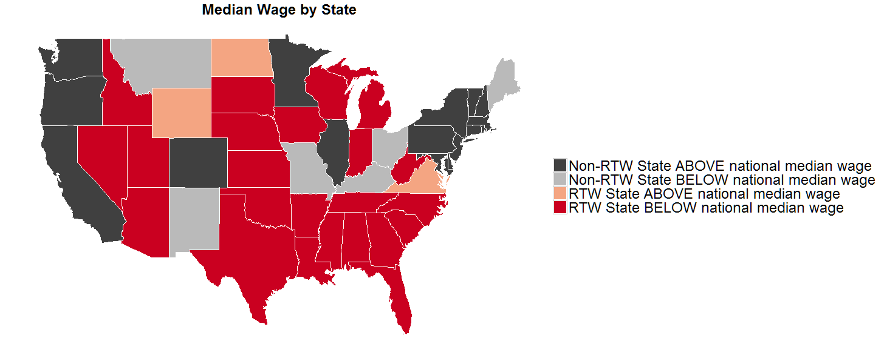
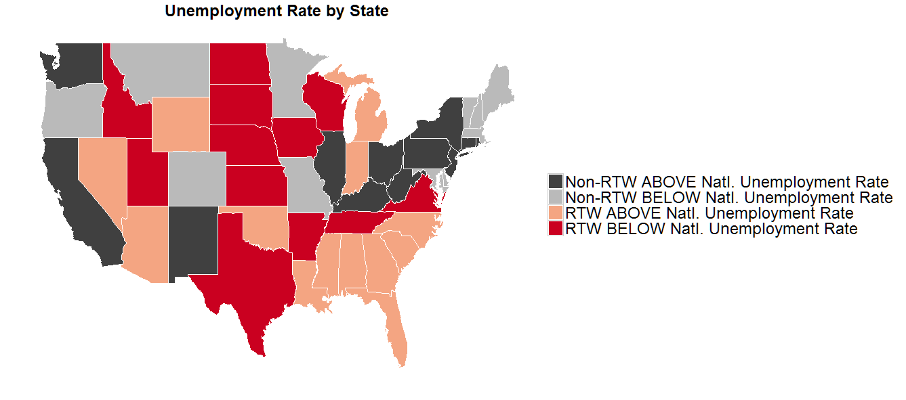

```{r, include=FALSE}
library(ggplot2); library(ggmap);library(RColorBrewer); library(dplyr);library(DT);library(readr)
```




#Median Wage by State
```{r, echo=FALSE}
medianWage <- read.csv("../../rData/rightToWorkData/Rtw.mw4.29.16.csv", header = TRUE)
medianWage <- medianWage %>%
                     filter(region != "district of columbia")
count(medianWage, rtw.mw)
```

#Unemployment by State
```{r, echo=FALSE}
unemployment <- read.csv("../../rData/rightToWorkData/unemploymentRateByState.csv", header = TRUE)
rightToWorkStates <- read.csv("../../rData/rightToWorkData/rightToWorkStatesData.csv", header = TRUE)

Total <- merge(unemployment, rightToWorkStates, by="region")

nationalUnemploymentRate <- 4.7

Total <- Total%>%
              mutate(unemploymentRateComparedToNational = ifelse(unemploymentRate < nationalUnemploymentRate, 1, 
                                                                 ifelse(unemploymentRate >= nationalUnemploymentRate, 2, 0)))

Total <- Total%>%
              mutate(unemploymentRateAndRightToWork = ifelse(unemploymentRateComparedToNational == 1 & rightToWork == 0, "Non-RTW BELOW Natl. Unemployment Rate", 
                                                              ifelse(unemploymentRateComparedToNational == 2 & rightToWork == 0, "Non-RTW ABOVE Natl. Unemployment Rate", 
                                                                     ifelse(unemploymentRateComparedToNational == 1 & rightToWork == 1, "RTW BELOW Natl. Unemployment Rate", 
                                                                            ifelse(unemploymentRateComparedToNational == 2 & rightToWork == 1, "RTW ABOVE Natl. Unemployment Rate", 0)))))
Total <- Total%>% 
              filter(region != "district of columbia")
count(Total, unemploymentRateAndRightToWork)
```

```{r echo = FALSE}
medianWagebyState <- read.csv("../../rData/rightToWorkData/medianWageByState.csv")
medianWageAndUnemployment <- merge(medianWagebyState, unemployment, by="region")
nationalUnemploymentRate <- 4.7
medianWageAndUnemployment <- medianWageAndUnemployment %>%
                                   mutate(unemploymentRateComparedToNational = ifelse(unemploymentRate < nationalUnemploymentRate, 1, 
                                                                 ifelse(unemploymentRate >= nationalUnemploymentRate, 2, 0)))%>%
                                   filter(region != "district of columbia")
medianWageAndUnemployment <- medianWageAndUnemployment %>%
                                   mutate(status= ifelse(MEDWAGE == 0 & unemploymentRateComparedToNational == 2, "bad Combo", 
                                                         ifelse(MEDWAGE == 1 & unemploymentRateComparedToNational == 1, "good combo", "other")))
count(medianWageAndUnemployment, status)
medianWageAndUnemployment %>% datatable()
```
####Source: BLS, BLS OES,  National Conference of Legislatures Right-to-Work Laws and Bills.
